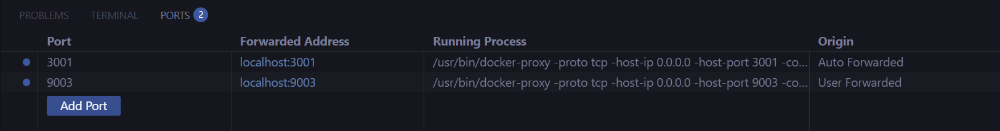
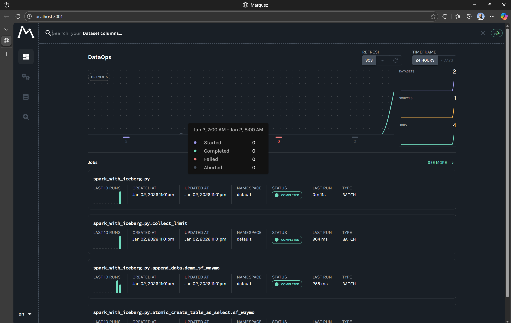
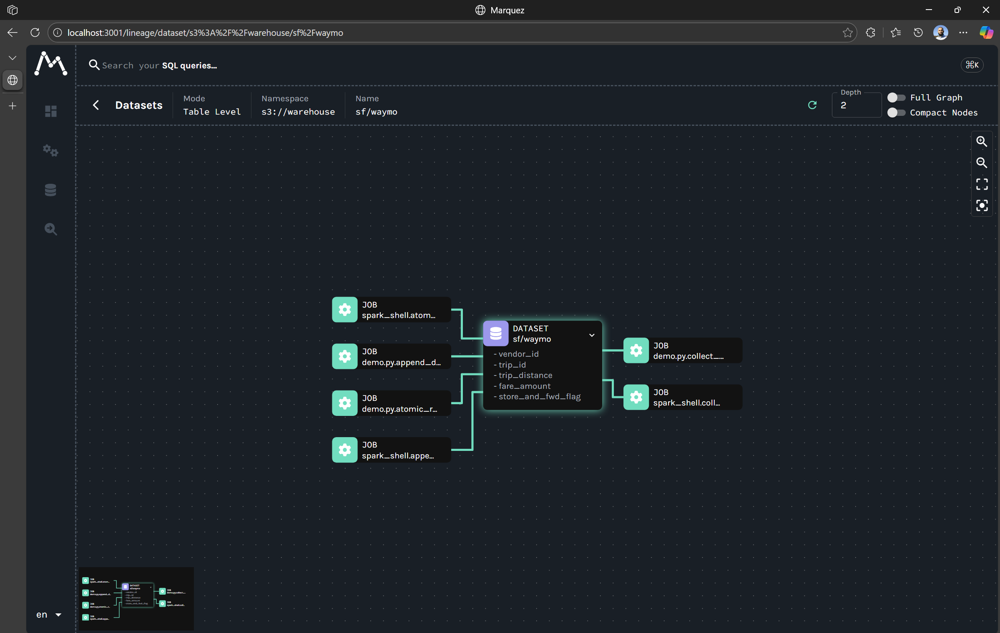

<!-- PROJECT LOGO -->
<p align="center">
  
  <h3 align="center">OpenLineage Sandbox</h3>
  <p align="center">
    Messing around to learn OpenLineage.
    <br />
    <br />
    ·
    <a href="https://openlineage.io/">OpenLineage Overview</a>
    ·
    <a href="https://oleander.dev/blog/simplify-data-observability-with-openlineage">Good tutorial</a>
    ·
  </p>
</p>

## Context

This repository contains my lessons learned from hacking around with OpenLineage.

## Quickstart

## Marquito

Little Marquez.

```bash
export PATH="/home/boor/.local/node/bin:$PATH" && cd marquito && npm run dev
```

## Marquez

Launch Marquez in Docker (first time takes a few minutes):

```bash
git clone https://github.com/MarquezProject/marquez.git
cd marquez
./docker/down.sh -v && ./docker/up.sh --build --api-port 9003 --api-admin-port 9004 --web-port 3001
```

Forward ports `9003` and `3001`:



Launch Spark in a standalone container:

```bash
GIT_ROOT=$(git rev-parse --show-toplevel)
COMPOSE="docker compose -f ${GIT_ROOT}/docker/docker-compose.yaml"
rm -rf ${GIT_ROOT}/spark-mnt/lineage.json
$COMPOSE down && $COMPOSE up
```

Fire Spark to generate lineage on disk:

```bash
PACKAGES=(
  "io.openlineage:openlineage-spark_2.12:1.26.0"
  "org.apache.hadoop:hadoop-azure-datalake:3.3.4"
  "org.apache.hadoop:hadoop-azure:3.3.4"
  "io.delta:delta-spark_2.12:3.2.0"
)
PACKAGES_STR=$(IFS=,; echo "${PACKAGES[*]}")

SPARK_CONFS=(
  --conf "spark.jars.packages=$PACKAGES_STR"
  --conf "spark.extraListeners=io.openlineage.spark.agent.OpenLineageSparkListener"
  --conf "spark.openlineage.transport.type=file"
  --conf "spark.openlineage.transport.location=/opt/spark-mnt/lineage.json"
  --conf "spark.sql.extensions=io.delta.sql.DeltaSparkSessionExtension"
  --conf "spark.sql.catalog.spark_catalog=org.apache.spark.sql.delta.catalog.DeltaCatalog"
)

docker exec -it spark /opt/spark/bin/spark-submit "${SPARK_CONFS[@]}" /opt/spark-mnt/demo.py
```

Hydrate lineage into Marquez:

```bash
$(git rev-parse --show-toplevel)/.scripts/send-lineage.sh
```



Lineage from Python and Scala jobs:

